I've recently taken a bit of a break from work - I was completely burnt out and exhausted of living in America and the restrictions it was placing on my life/oppertunities. I came back to the UK, rested for a bit, and then a long cycling trip seemed like a fun idea.

Recently the [North Coast 500](https://www.northcoast500.com/) has become a much more established route around the coast of Scotland, so I decided to give it a shot. I was staying in B&Bs, because I was cycling on my own (and solo camping is pretty depressing). The trip ended up taking about 2 weeks, with a couple of rest days included. At the end, I veered off the route a little and cycled further down to Glasgow, rather than completing the loop back up to Inverness.

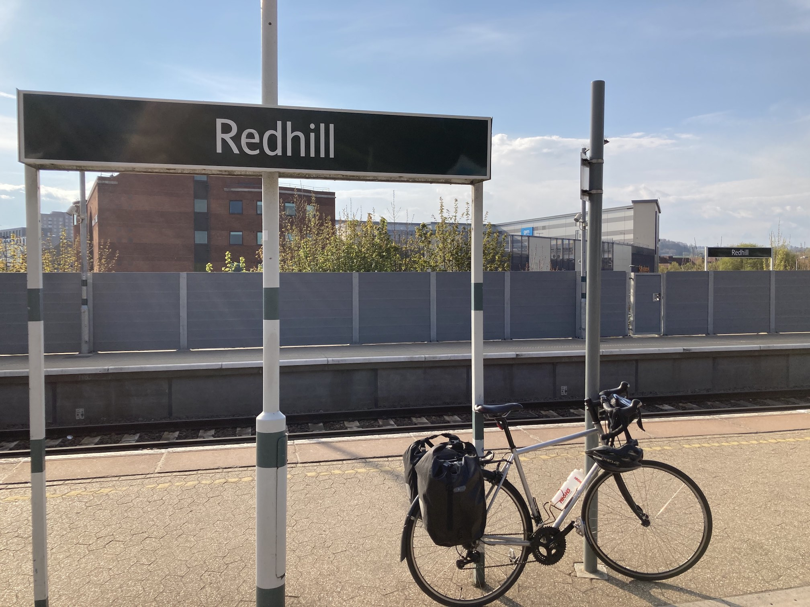

_At the train station setting off for Inverness._

## Day 1 Inverness to Brora (59 miles)

After arriving into Inverness on the sleeper train from London, I set off in the early morning heading North up the East coast of Scotland. The first 40 miles flew by, with a great bike path almost the whole way to Tain (or well marked bike lanes on a moderately busy road). I got to Tain and had breakfast for lunch in a greasy cafe.

After lunch, the wind seriously picked up and the rest of the day was pretty bleak - it took me the same amount of time to cycle the next 20 miles as it had done the previous 40. Also, I overdid it on the first day of cycling with a reasonably heavy bike (mostly due to the wind, which increases your revolutions substantially because you have to fight to progress, even on the flat). By the end of the day my IT band was very painful, and walking was difficult. Thankfully, you can't actually damage your IT band from cycling - it's just painful, so I bought some painkillers and vapour rub to help.

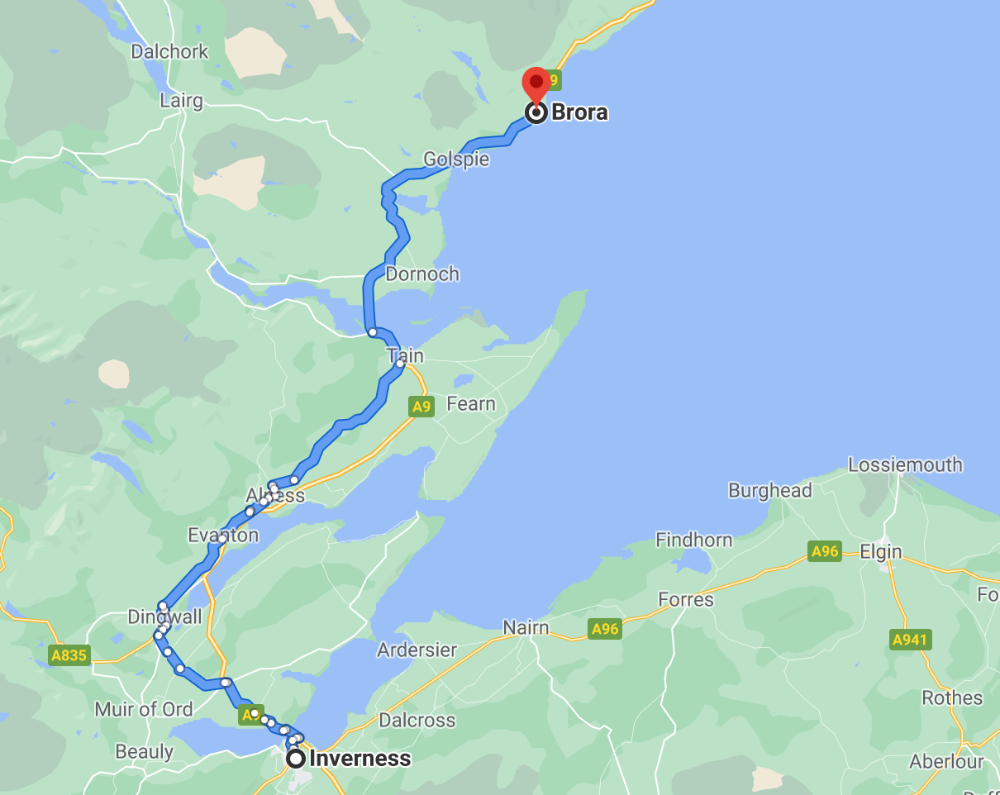

## Day 2 Brora to Thurso (20 miles + train)

I tested out my knee in the morning by cycling 10 miles along the coast - it still hurt quite a bit, and the wind was still pretty vicious, so I decided to jump on a train for most of the rest of the day. I got off about 10 miles outside of Thurso and cycled in. Getting the train made me realise how remote the Highlands are - there are no staff at the stations, or ticket machines - you have to buy a ticket on the train. When I got on, the guard's ticket machine was broken, so I ended up just getting the train for free!

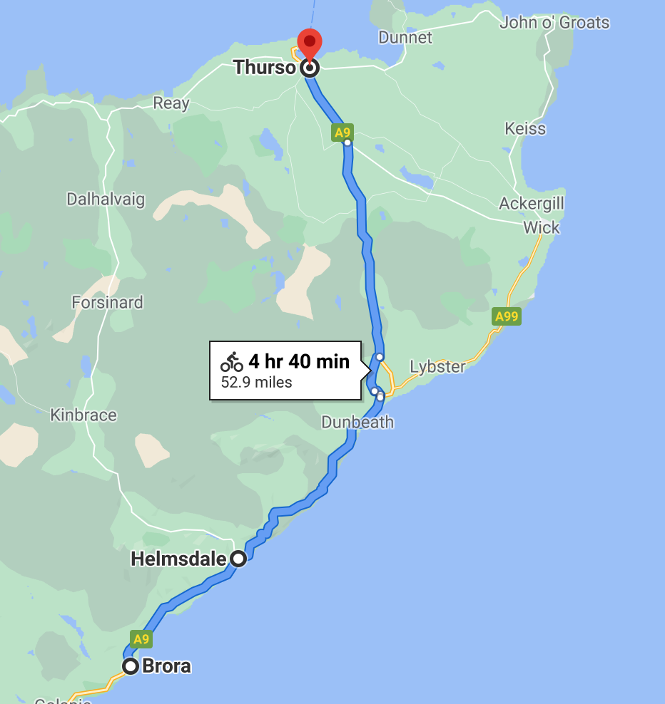

The rest of the day was cycling through endless fields of sheep, with quite a few big wind farms. I ended up in Thurso and did a LOT of streching, which helped my knee quite a bit. I then had a massive curry which was extremely nice.

## Day 3 Thurso to Tongue (43 miles)
This was the first really good day of cycling - the weather cleared up a bit and I was eating Neurofen like skittles to ease the pain in my knee. There were a lot of interesting things to look at along this bit of the North Coast - some small towns, great beaches (one where I had lunch below) and a nuclear material decommisioning site, which I didn't take a photo of, because there were explict signs on the fences specifying no photos. 

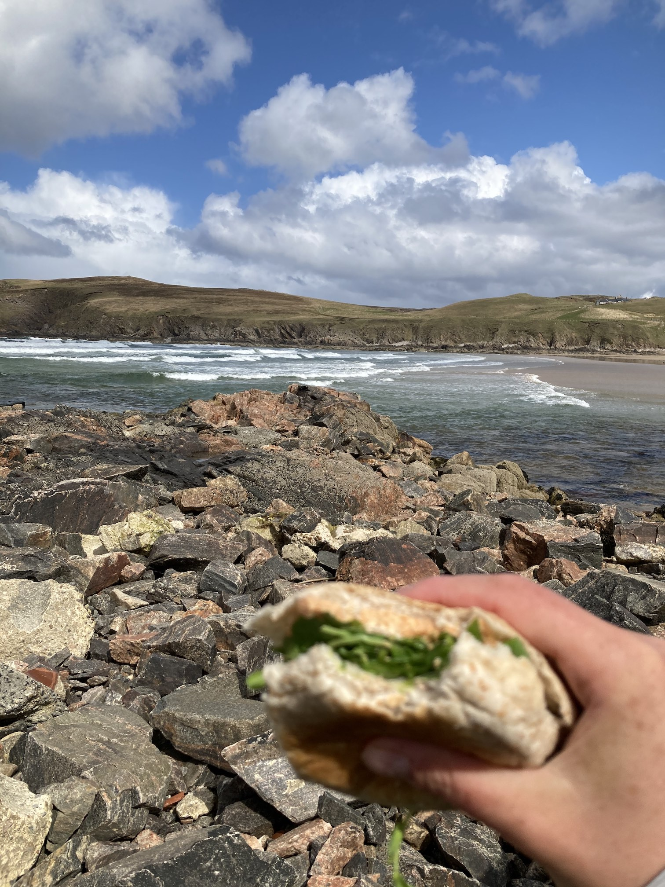

_Not a bad lunch location._

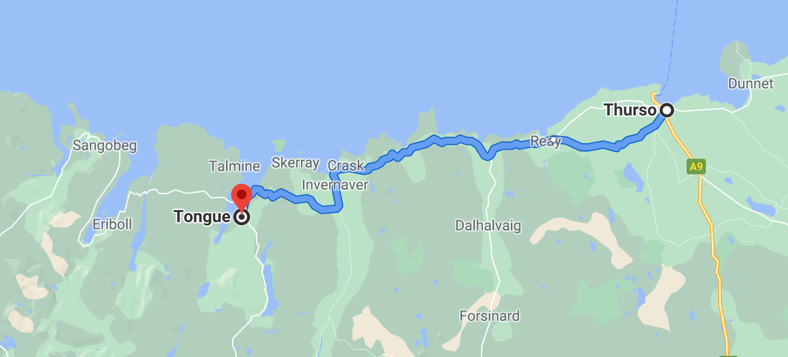

When I got to Tongue, I stayed in a B&B run by a very nice German woman. I was also the only person in the B&B, which was great because it meant I could use the communal spaces. In the morning, I had a full Scottish breakfast, including something i'd never encountered (or heard of): Fruit Pudding. It's a similar shape to black pudding, but it has currants and raisins and mixed peel in it, with a texture and flavour similar to christmas pudding. But for breakfast. Quite confusing.

## Day 4 Tongue to Achlyness (44 miles)
Leaving Tongue, it was torrentially raining and extremely windy. After about an hour of cycling it started hailing, and I had to stop for about 20 min because having my eyes open was too painful on the bike. After crossing the very exposed mouth of a loch, the next 20 or so miles were more sheltered along the sides of a loch over the summit of a hill. This was great cycling because it was mostly downhill.

### Smoo Cave

Halfway round, I stopped at Smoo Cave for lunch (picture below). This cave is very geologically unique, because it has several chambers which were formed via different methods. The outer chamber was formed by the sea, but the inner two chambers were formed by a river flowing into the sea.

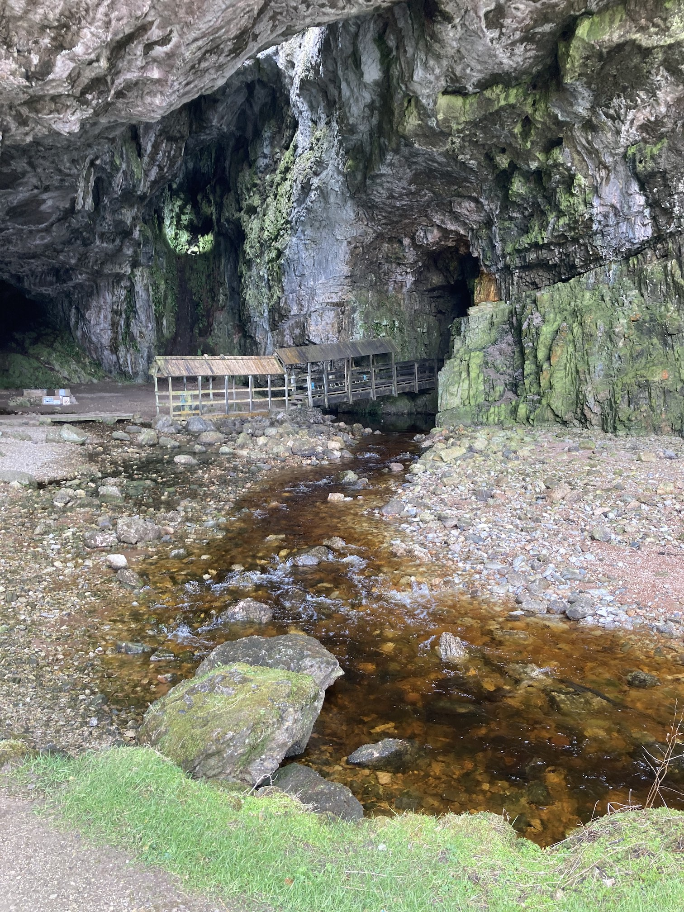

_The mouth of Smoo Cave in Durness._

I also had some great sandwiches with coleslaw and pea shoots in. I had previously considered pea shoots to be a delicacy, but I found a bag of them for a pound in the co-op, so maybe it's a northern thing.

In terms of small towns, Achlyness is a Small Town. The host of my B&B very kindly picked up some fish and chips for me, which was pretty great after a long day of cycling.

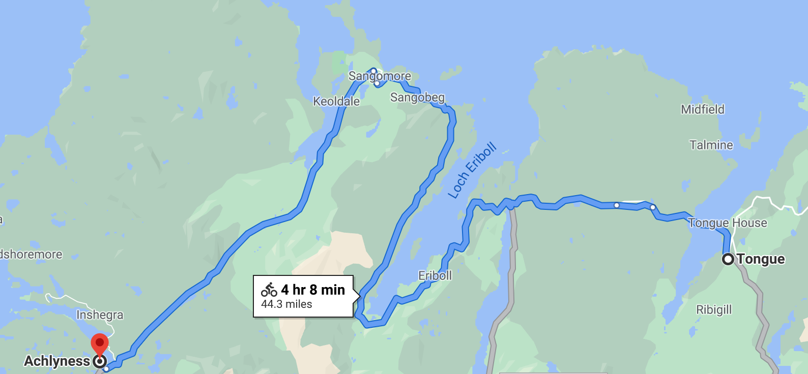
## Day 5 Achlyness to Lochinver (45 miles)
I woke up to a beautiful sunny day - after a great breakfast I hit the road. Today was really the first day of the West Coast proper, which is considered to be the best part of the NC 500. I made pretty good time in the morning, getting to Unapool and the Kylesku Hotel by 11. I stopped there for tea and a scone. It's a pretty cool hotel - very remote, and serving some of the freshest seafood i've seen. When I was there, I watched one of the fishing boats come in to the tiny dock by the hotel, walk directly up to the hotel with a crate of langoustine and drop it off.

After my scone, I turned right off the main road, onto the "scenic" costal road to Lochinver. The road was tiny - basically a single lane, with spots to pull out every 400/500m. It was also _brutally_ hilly, really aggressive >15% inclines and steep twisty descents. It was pretty slow going, but great scenery and very few cars, which was nice. Halfway along I stopped in Durness, where there was a little shop. I think I alarmed the lady working in there, because I bought a sandwich and basically swallowed it whole outside the shop - after which I went back in for another one.

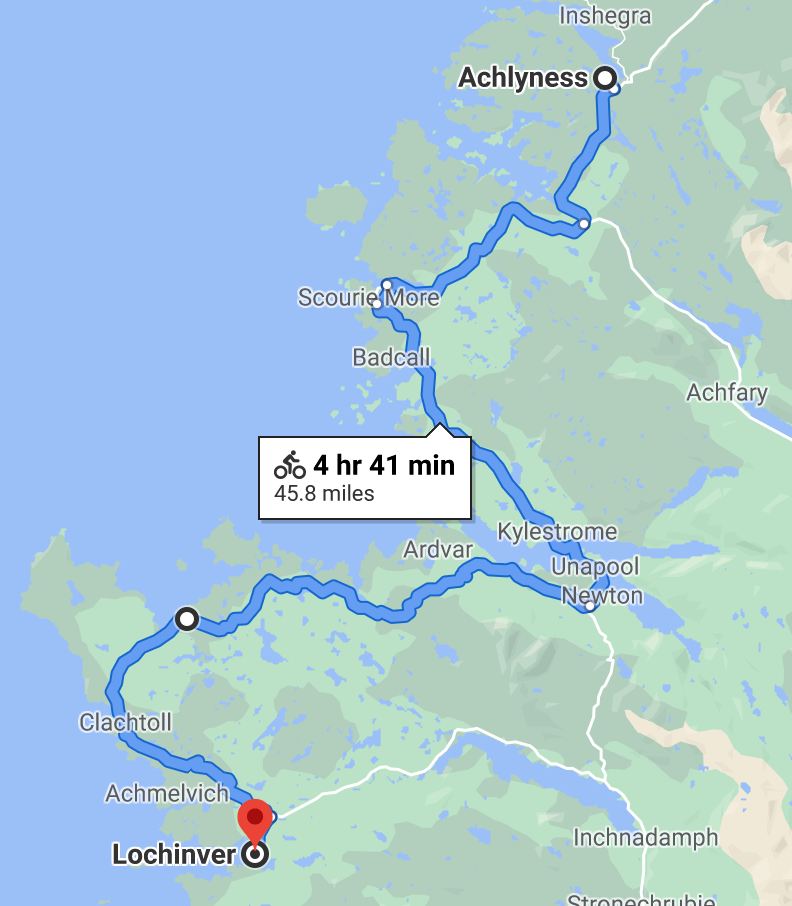

### The Blessed Pie Shop

After I arrived in Lochinver, I dumped my stuff in my B&B and headed straight down to a pie shop ([the Lochinver Larder](https://www.lochinverlarder.com/)) on the recommendation of the lady running the place I was staying. I had a pie, mash, peas and onion gravy with a beer, which was 10/10 end to the day. I also got a killer apple and blackcurrant pie for lunch for tomorrow.

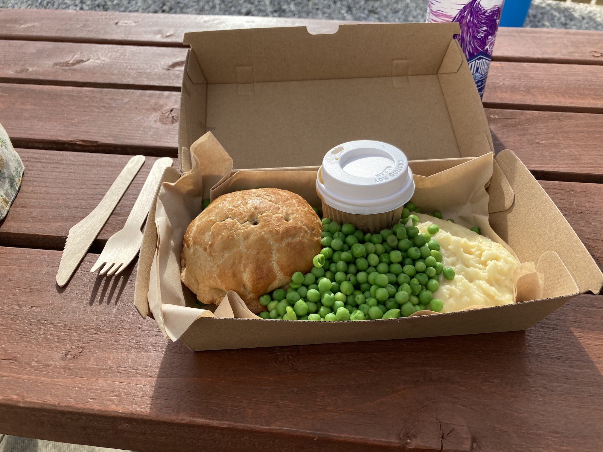

_The exceptional pie from the Lochinver Larder. 10/10 would recommend._

## Day 6 Lochinver to Ullapool (30 miles)
This was meant to be a short day, riding into Ullapool. I had noticed that the route I was taking into Ullapool was not on the official NC 500 route - I thought this was a bit odd, because it certainly seemed more scenic. I quickly realised why this route was avoided (and I should have realised given the sign at the start indicating a length limit for cars) - it was incredibly steep and twisty, with and even thinner road than the one into Lochinver.

Halfway to Ullapool, I met another solo cyclist, who was also called Mark! He'd actually cycled around the world, and he was just up in Scotland for a weekend adventure. We exchanged numbers and had a couple of drinks and some fish and chips in Ullapool. He was from Cambridge and owned his own interior design firm, fitting out offices for tech companies in Cambridge. He was an extremely interesting guy.

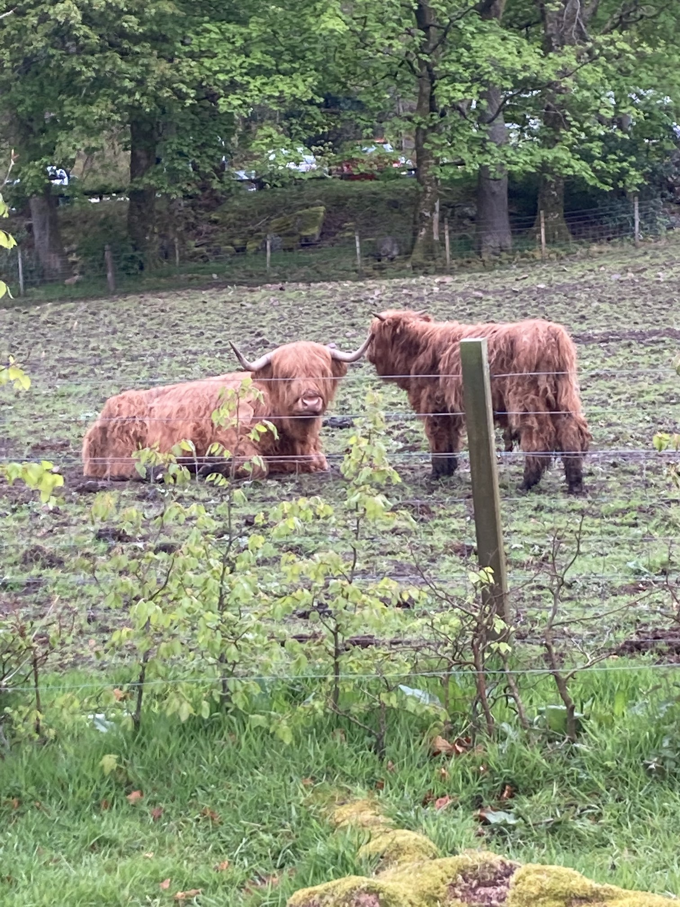

_Along the west coast, I began to see these exceptionally beautiful Longhorn cattle._

I'm very glad I met the other Mark because the wind from the point I met him into Ullapool was utterly relentless and I swear there were points I had to pedal to go downhill. Without the motivation of a couple of beers at the end, I doubt i'd have made it.

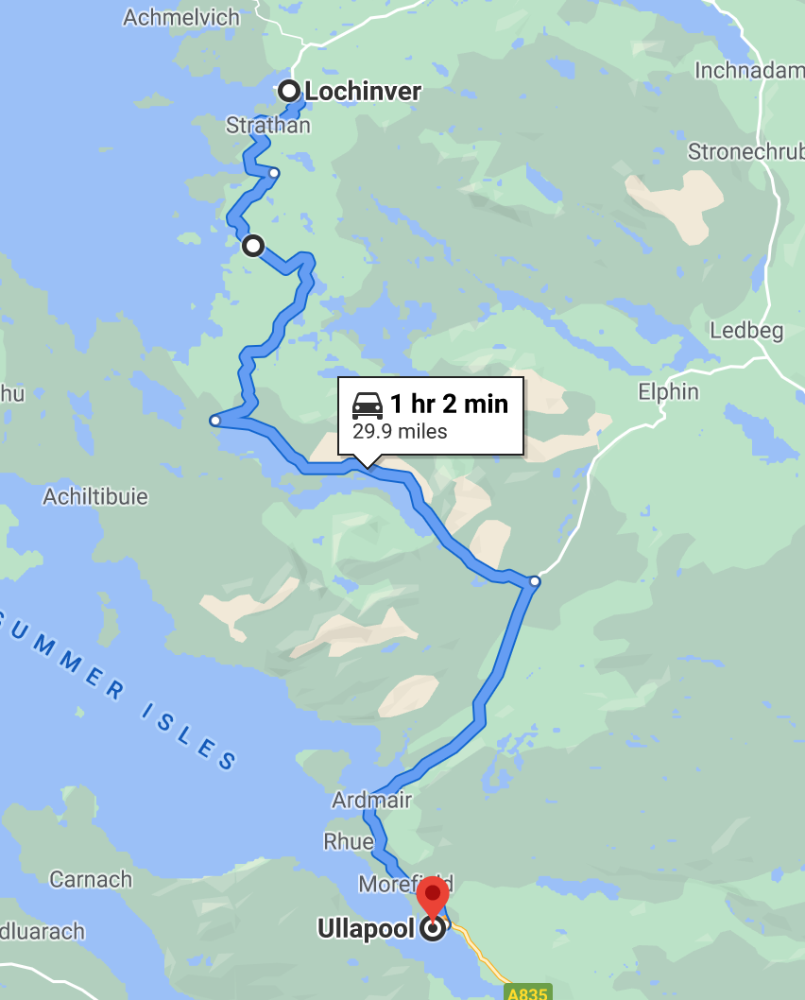

## Day 7 Rest day 

I had a bit of a rest day in Ullapool, taking some time to just chill out. I went on a boat tour of some of the islands near the harbour, and saw 2 kinds of seals and a porpoise (small dolphin), which was a brilliant way to spend 25 quid. 

### The seafood shack

The guy that ran the boat trips was a commercial fisherman, and he told me that his other half ran a place called [The Seafood Shack](https://www.seafoodshack.co.uk/) in the middle of the town, which essentially took some of the his catch daily and cooked it up. I ate here two days in a row it was so good - some of the best seafood i've ever had. Quite rightly, it's won a bunch of awards and they've been featured on the BBC several times.

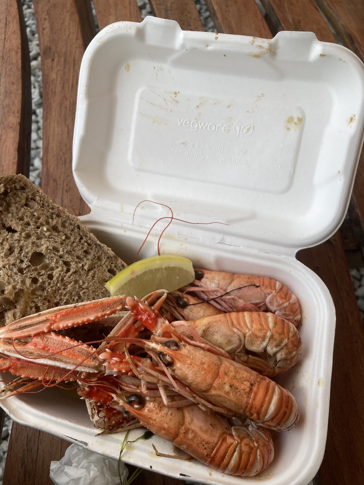

_Langoustines from the seafood shack. Some of the freshest seafood i've had._

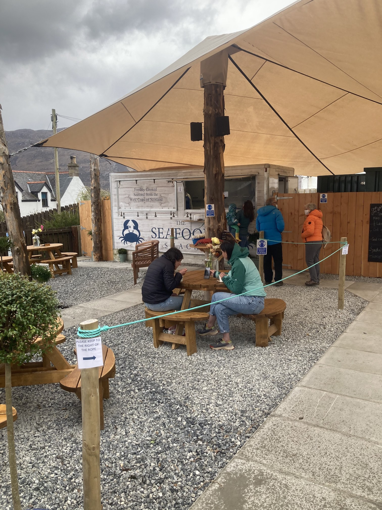

_A pic of the shack itself. A really basic setup, serving 6-8 dishes which change daily._

## Day 8 Ullapool to Gairloch (55 miles)
Today was a great day riding - I was a bit apprehensive because it was the longest day since i'd hurt my knee going too hard on day 1, but I felt refreshed from the rest day and the first 10 miles or so were downhill. 

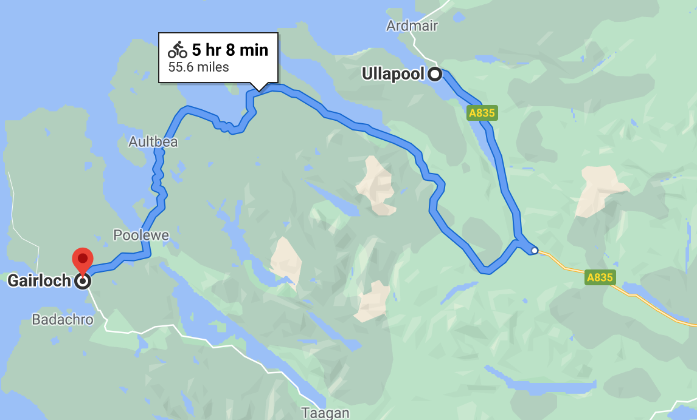

### Corrieshalloch Gorge

Then, there was a big climb up to Corrieshalloch Gorge, the deepest gorge in the UK. I stopped for a bit to check it out - including walking over an insane suspension bridge which wobbles when you walk on it, and has a 5 person limit.

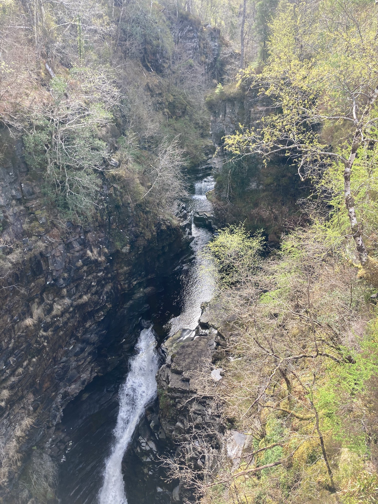

_Looking down at the gorge. The perspective of this photo doesn't really do it justice._

After that, I turned off the main road onto the coastal road out to Gairloch. This was an exceptionally beautiful section, and you could really feel the influence of the numerous small crofting communities dispersed along the road.

There were some exceptional beaches along this stretch too.

### Inverewe Gardens

Just outside of Gairloch, I came across [Inverewe Gardens](https://www.nts.org.uk/visit/places/inverewe). Apparently the gulf stream and the shape of the bay here make a kind of micro climate, where many plants can grow that would otherwise not grow in Scotland. They had an incredible walled garden looking out over the bay, as well as lots of other regionally themed gardens. Pretty cool.

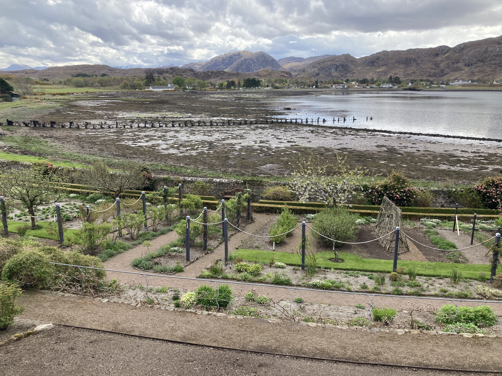

_The long walled garden looking out over the bay at Inverewe._

## Day 9 Gairloch to Applecross (55 miles)

Today was also a great day of riding. Today and yesterday strike me as the "unmissable" segments of the West Coast. 

Halfway though I was directed through the Torridon estate - this was a big mistake, because the track is more of a path, designed for hiking and mountain bikes. The Torridon Estate is home to a very fancy hotel of the same name (think $700 a night). After about 5km of beautiful off road scenery, I managed to escape through several gates to the main road and continue on my way.

Once again, I turned off the main road, onto the coastal road to Applecross. This was similar to most of the coastal roads - very twisty, very turny, very scenic. Along this stretch, there were lots of fish farms (salmon, I think) to look at, which are quite cool - you can see the fish jumping in their pens and there's quite a bit of infrastructure for catching them and maintaining the farm etc, but it's more interesting because everything is floating.

After a bit, this road turned south along the coast towards Applecross, with some great views of Skye and the Outer Hebrides.

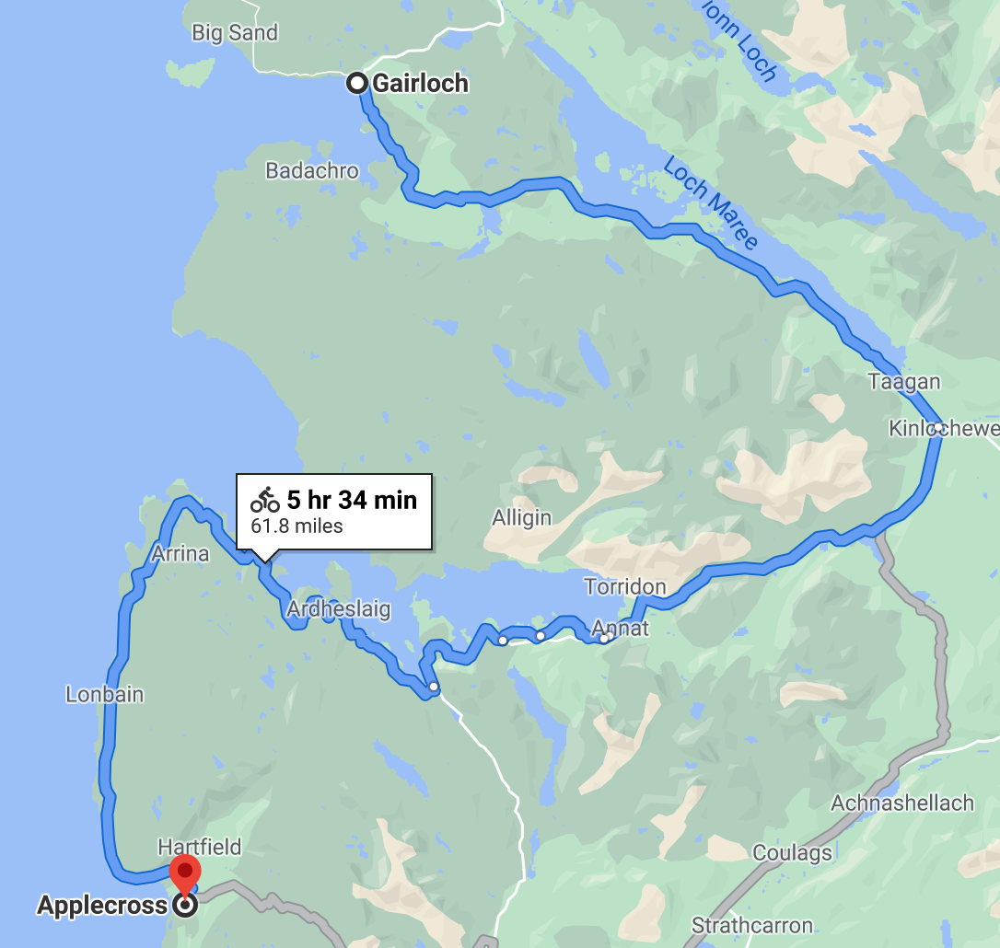

### The Walled Garden

In the evening, I ate in one of the most beautiful places i've ever been to. The [walled garden of Applecross house](https://www.applecrossgarden.co.uk/) was taken over by a couple in the early 2000s, when it was completely derelict. They've since opened a cafe, and then a restaurant, and are in the process of converting the garden into a full kitchen garden again. It's an incredible place - it's clearly a small operation and still feels very wild.

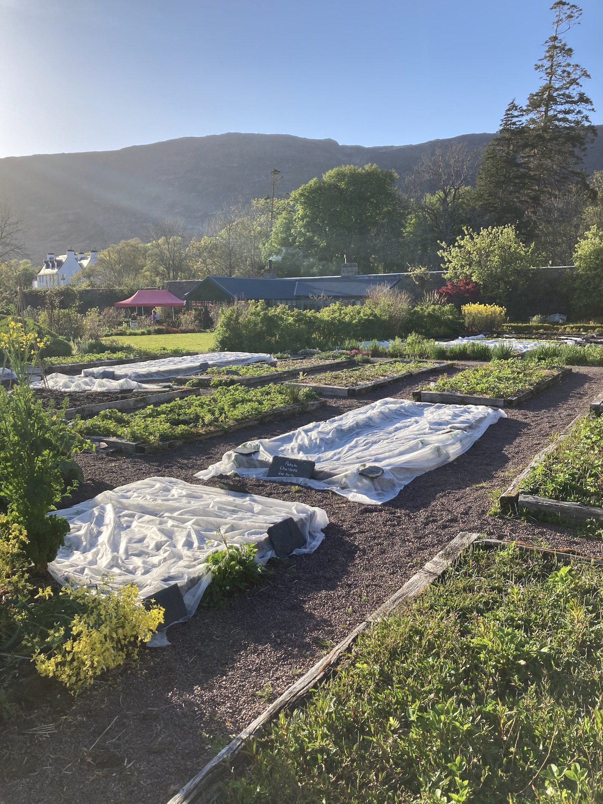

_The walled garden in Applecross_

## Day 10 Rest day + Fishing!
I took another rest day in Applecross because i'd heard it was meant to be one of the most spectacular stopping points on the route, but also because I found a company ([West Coast Fishing Co](https://www.westcoastfishing.co.uk/)) that ran fishing trips for beginners! Fishing is something i've always wanted to do, but i've never had the chance. It was great fun - I went sea fishing and loch fishing, and caught a big fish.

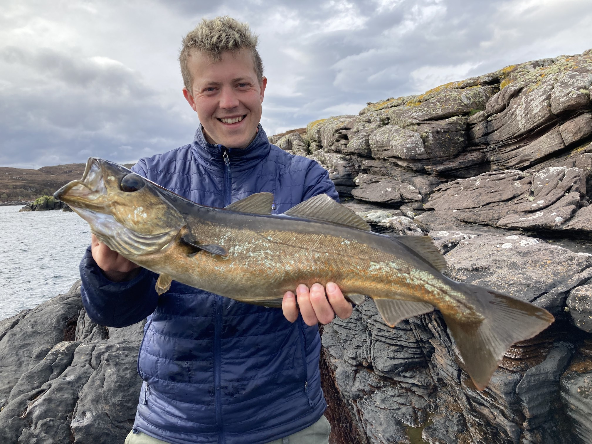

_Me with the pollock I caught fishing just north of Applecross with West Coast Fishing Co._

## Day 11 Applecross to Duisdealmor (55 miles)
After breakfast at the Applecross walled garden, I hit the part of the trip where I diverged from the official route. Typically, people head back to Inverness from Applecross, but I wanted to visit Glasgow, and i'd found a route which involved taking a train over the viaduct in Harry Potter and seeing where Dumbledore is buried (apologies for the spoiler. He dies). 

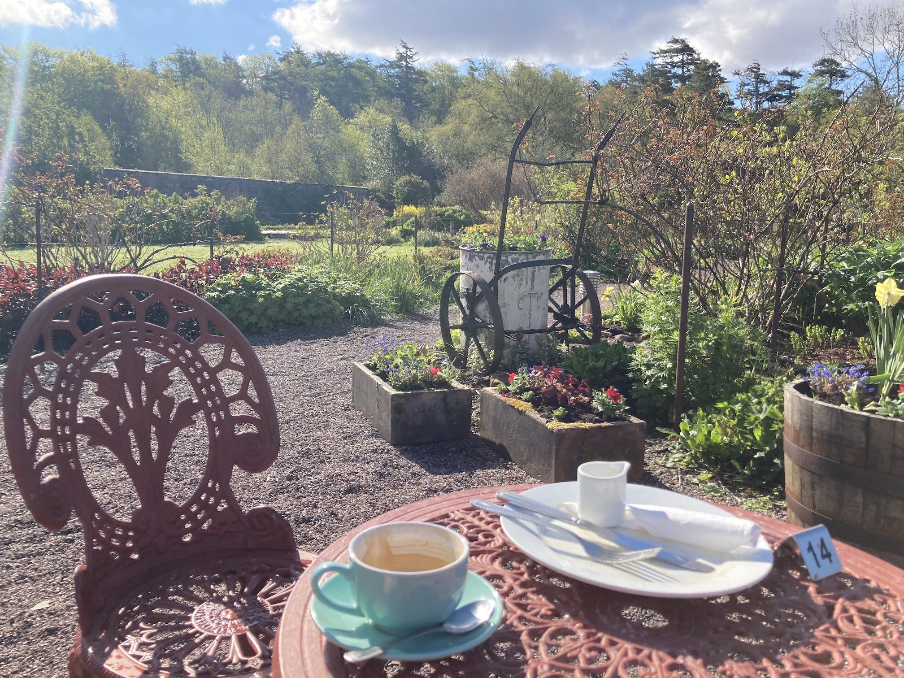

_Sunny morning after breakfast in the walled garden._

### Bealach Na Ba

Coming out of Applecross is the [Bealach Na Ba](https://en.wikipedia.org/wiki/Bealach_na_B%C3%A0), the steepest road and third highest mountain pass in the UK. Safe to say, it was an extremely tough climb and certainly the steepest road i've ever climbed on a bike (including many Alpine climbs I've done on a previous trip to Turin). Once I got to the top, the descent was almost as sketchy as the climb - almost too steep in places, my hands were aching at the bottom from holding the brakes steady the whole way down.

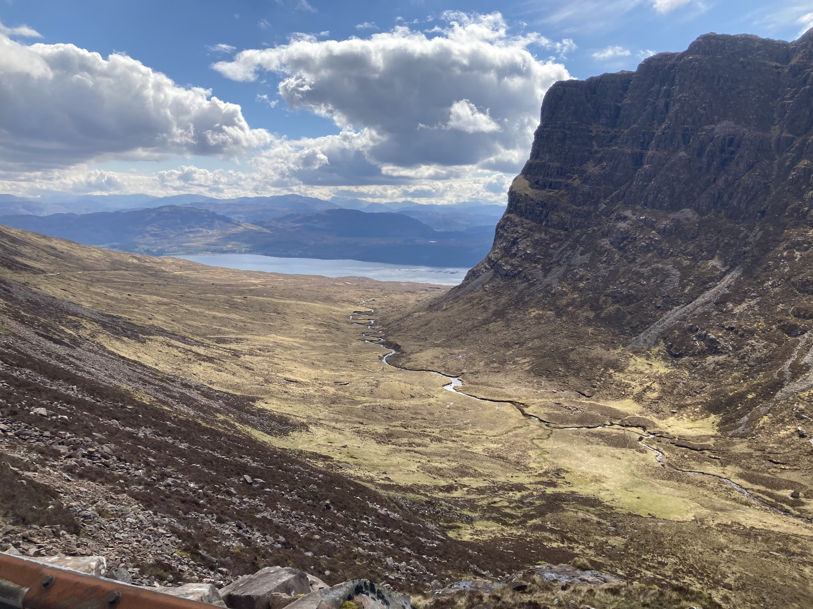

_The view down in to the valley the other side of the Bealnach pass._

Once I turned the corner of the loch/inlet at Strathcarron, it was nice riding all the way down to Kyle of Lochash, the small port town near the bridge to the Isle of Skye. On my way out of town, something quite remarkable happened. 

### Unicorn Man

I met a elderly Scottish man who waved at me as I cycled past. I stopped for a chat, because the previous bit of cycling had been a bit mundane and I was in need of a bit of a break anyway. This meeting turned out to be quite bizzare.

This man told me that he cycled to and from the bridge to Skye daily, until he felt tired. He told me that he regularly stops and chats to people along the way, and passed on some sage advice, including to live in the present. He followed up with an anecdote about a South Korean cyclist he'd found asleep in a bus station on the same strech, who apparently only responded to him after he used a deeply offensive asian accent. I didn't have the heart to tell this man that this was no longer acceptable, but afterward he gave me a unicorn sticker to put on my bike. He'd apparently given out over 800 of these stickers just on this one strech of road.

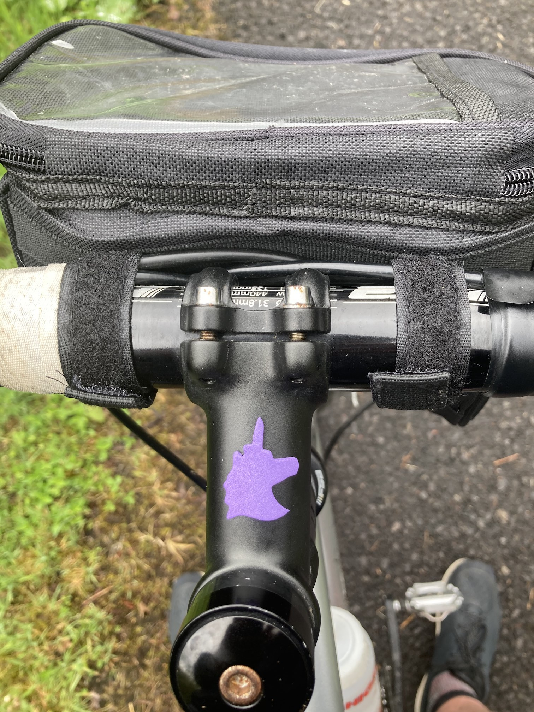

_The unicorn sticker an elderly man gave me on the bike path to the Skye bridge._

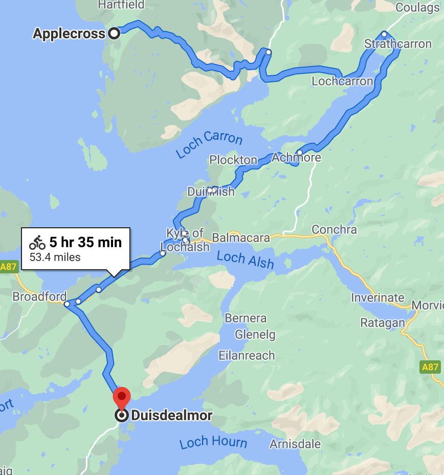
## Day 12 Duisdealmor to Glenfinnan (39 miles)

Today I rode down to catch the ferry across to Mallaig. The ride was pretty unremarkable - there was nice mountains and stuff, but nothing fantastic, until.....

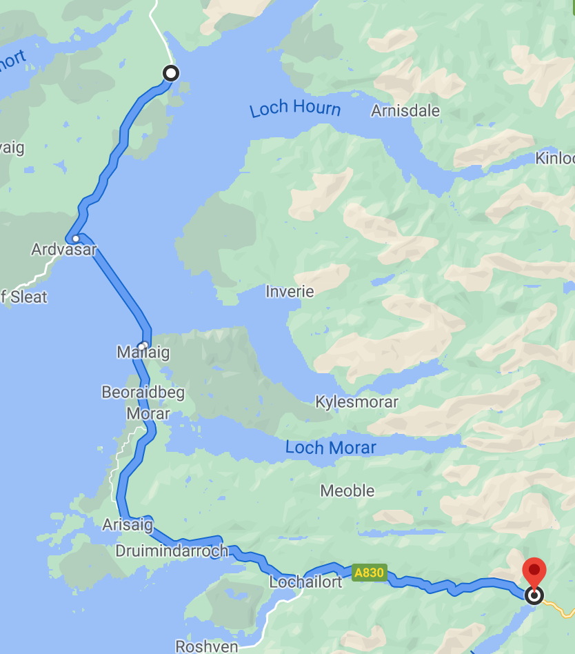

### Dumbledore's burial site

I was randomly looking on google maps for a decent place to have lunch, and noticed that a tiny island in one of the small lochs had been marked as a tourist attraction. Turns out, this is where they filmed the burial bits when Dumbledore dies in the Harry Potter films. So, obviously I had lunch there. Nothing like a can of Iron Bru and 4 sandwiches to pay my respects to the big man. Rest in Peace.

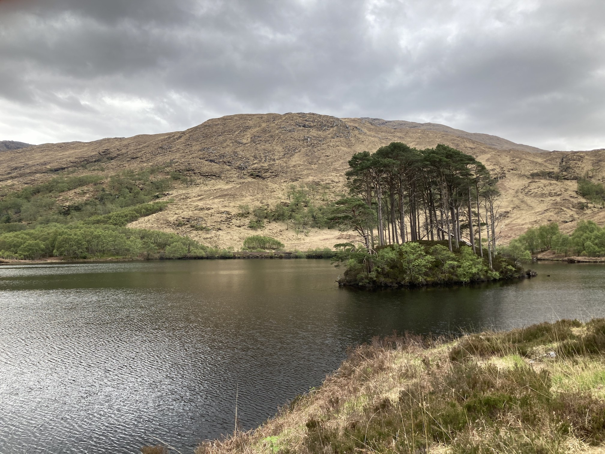

_The burial site of Dumbledore in the Harry Potter films._

## Day 13 Train from Glenfinnan to Tarbet, then cycling to Glasgow (37 miles)
I got up super early to catch the train (one per day, leaves at 6:50am RIP) from Glenfinnan to Glasgow. It almost immediately went over the viaduct used in the Harry Potter films, which was actually less cool than I thought it was going to be - the viaduct seemed pretty small... 

After a couple of hours on the train, it had taken me to Tarbet, at the northern end of Loch Lommond. I jumped off the train here to get a decent days' cycling in before reaching Glasgow. The ride was actually quite nice, because there was a semi-secret bike path the whole way (which google will direct you to, but not actually show on a map, making it a little confusing), but compared to the rest of the west coast, it was a tough comparison. Thankfully I killed some time by listening to two episodes of Grounded, Louis Theroux's podcast series he released during the pandemic. I also had a nice pizza halfway though from a small van which the owners had built a pizza oven into.

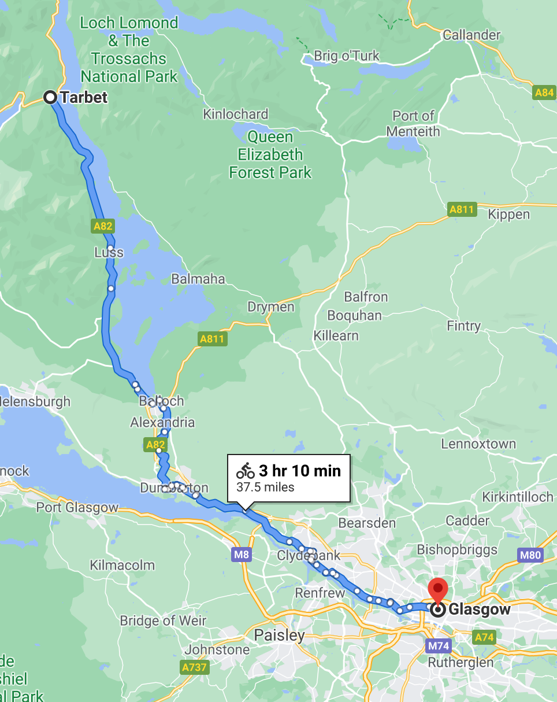

After getting into Glasgow, I did a bit of cycling round the city, visiting the ~30 large murals painted in various locations around the city. This was a great way to explore - it felt low commitment, but also gave me an objective of "collecting" all the pictures. Here are a couple of them:

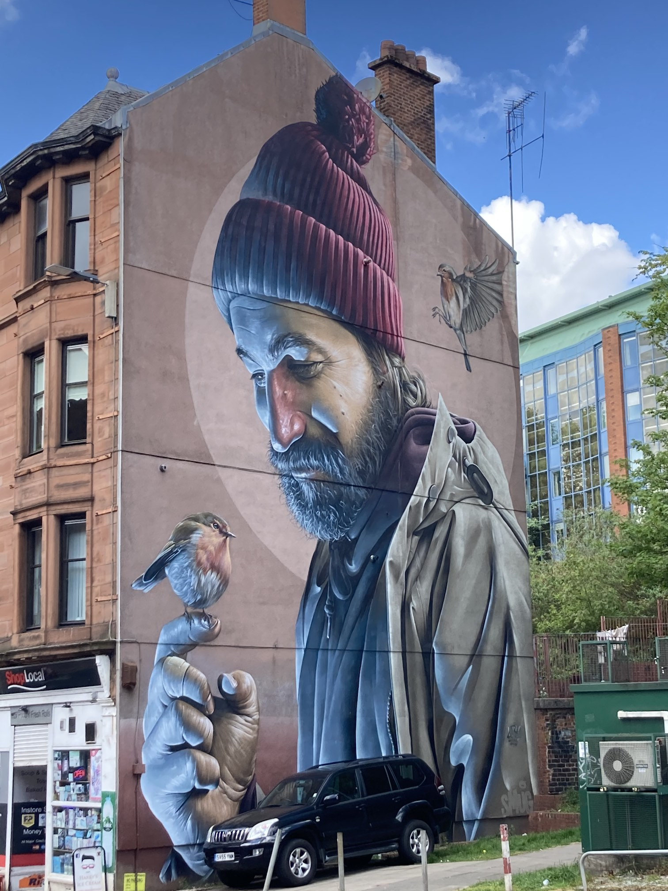

_One of the more famous recent murals in Glasgow by Australian artist, Smug._

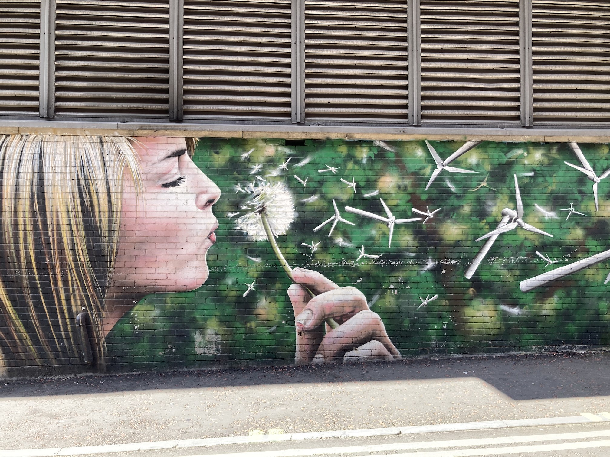

_My favourite mural._

### Summary

Overall, the North Coast 500 is a brillant route around the top of Scotland. I may have been slightly lucky timing wise, as given the pandemic there were less tourists than usual, making the roads quieter and great for cycling. I also went in May, so there weren't any midges out yet. But overall, it was a great trip - i'd recommend it to anyone, either by bike or by campervan, particularly the West Coast.