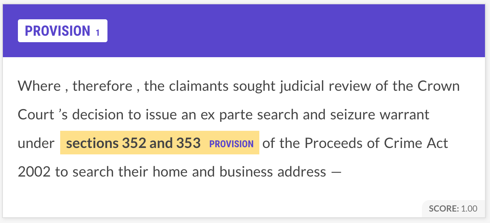
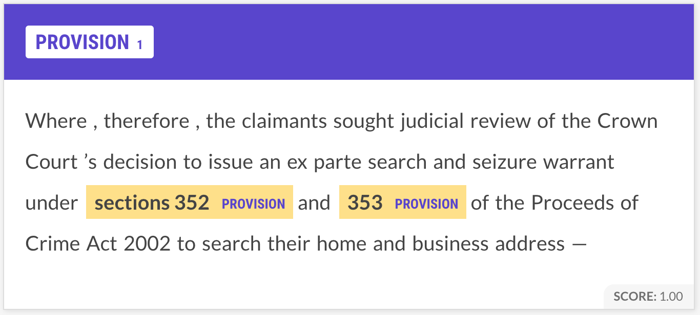

Recently, i've been annotating some legal data for a project i've been working on in my spare time with the great [Daniel Hoadley](https://twitter.com/DanHLawReporter). Annotating a reasonable quantity of data (i've done 2.5k densely annotated sentences over the past week or so) is quite an eye-opening experience. It's also quite cathartic, in the sense that you feel like you are being productive whilst doing something quite mundane.

## The annotation
With [Prodigy](https://prodi.gy/), the annotation tool from SpaCy (even with a version from I can't remember how long ago), you can annotate data very fast with a model in the loop. In order to be extra efficient and accurate, I was only labelling a single entity at a time, and using a model (trained on a single NER label) trained on ~200 hand annotated sentences as a model in the loop, whose span predictions I then corrected. Using Prodigy this way, I found I could label about 1k sentences/hour, for a single label.

 

## Numeric Fused Heads
In particular, Daniel and I have been anotating some legal data for a variety of legal entities that appear in case law. One of the entities is `PROVISION`, a reference to a subsection of a legal instrument (e.g a piece of the law). Multiple provisions are sometimes referred to in sequence using numeric references, **without an explict syntactic head**, like "sections 3 and 4 of A Very Important Act 2005". You can read more about what Numeric Fused Head constructions are in this brilliant paper by Yanai Elazar and Yoav Goldberg, [Where's My Head? Definition, Dataset and Models for Numeric Fused-Heads Identification and Resolution](https://arxiv.org/abs/1905.10886). I strongly recommend this paper - it's an easily approachable, interesting nugget of linguistics with a concrete application. 

This fused head construction presents a lowly NER annotator like me with a bit of a dilemma - how should these tied references be annotated? There are two options:
 
 
### Option 1: Annotate them as a single entity.

### Option 2: Annotate them as separate entities

It's tempting in this scenario to try and resolve the coordination between the two provisions _before_ deciding if they should be annotated jointly or not - in other words, asking the question - would the reference to these provisions have made sense if they were referred to independently? Clearly, this is extremely difficult to answer (it may depend on the content of the sections, requiring someone who is a real lawyer).

**Before reading on, how would you annotate them?**

## An answer

For me, annotating the entities as a single, fused entity makes the most sense **in practice**. This is for two main reasons:

### False positives

If you annotate the entities separately, you are opening your model up to a whole world of unecessary confusion. Your model will now get confused about whether individual numbers are effective features for identifying `PROVISIONS`, which will lead to lots of false positives. Thinking about it naively, it seems easier for a model to learn to always incorporate additional numeric conjunctions than to have to learn to look back at previous context to identify the numeric fused head of a number. Of course, these false positives could be correctly ignored **if** we had an effective method for determining the fused head of numbers in the sentence - e.g if we had a entire additional model!

### Resolution order

Even in the case that we had a very good model which could correctly differentiate between numbers which have a fused head, it still seems beneficial to annotate these entities jointly, as it makes the separation into individual entities straightforward. In the case that they are annotated separately, this becomes slightly more difficult, by introducing a slightly more involved possible coreference decision to resolve the entity to the correct section reference.

## Summary

It's certainly true that this might only be applicable in my specific case - section references in legal text are rarely conjunctions with more than 3 parts, meaning resolving fused heads isn't really that hard. However, one big takeaway is that this kind of attention to detail is important. With a sufficiently powerful model, it's possibly not hugely important which way around you annotate these types of entities. But what _is_ important is that the annotation method you choose for this construction should be consistent. Otherwise, your evaluation will suffer - how can your model know which type of span boundaries your prefer when it encounters this case? 

I mainly wrote this blog post because I thought I knew how to annotate NER data - and at the time, this really stumped me. Who knows how many datasets annotated by workers on Mechanical Turk have this artifact (mixed annotation of fused heads). Perhaps there is a more cannonical line of reasoning as to how these annotations should be done - if you know of a reference, let me know!
