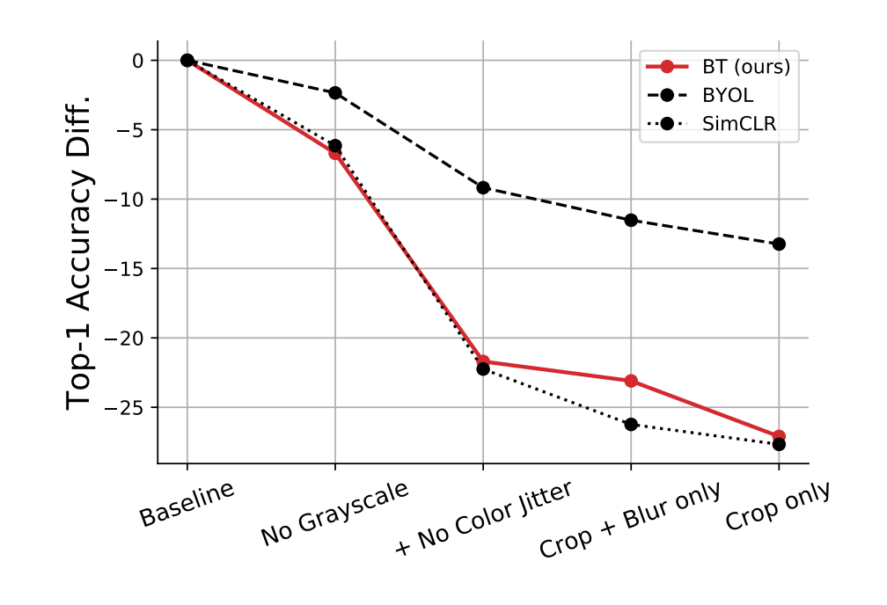

# Barlow Twins: Self-Supervised Learning via Redundancy Reduction 

## Authors :pencil:
**Jure Zbontar Li Jing Ishan Misra Yann LeCun Stephane Deny**

**Facebook**

### TL;DR :zzz: :book:

A simple constrastive loss function for representation learning.


This paper presents a very simple idea for contrastive representation learning - run several augmented images through an encoder,
batch normalise the representations, and then create a loss function from the cross correlation matrix of the two sets of representations, using the L2 difference between the diagonal of this matrix and the identity matrix as a loss function. This makes intuitive sense - running this same set of images through the same encoder would result in a cross correlation matrix with 1s on the diagonal. They also add a regularisation term consisting of the values in the off diagonal, encouraging images which are not the same to have lower similarity. That's basically the idea! Very simple and easy to understand.

```python
# Modified slightly from paper pseudocode.

for x in loader: # load a batch with N samples

    # two randomly augmented versions of x.
    x_a, x_b = augment(x)
    # compute representations using the same network.
    z_a = network(x_a) # NxD
    z_b = network(x_b) # NxD
    # normalize representations along the batch dimension.
    z_a_norm = (z_a - z_a.mean(0)) / z_a.std(0) # NxD
    z_b_norm = (z_b - z_b.mean(0)) / z_b.std(0) # NxD

    cross_correlation = mm(z_a_norm.T, z_b_norm) / N # DxD
    # loss
    cross_correlation_diag_loss = (cross_correlation - eye(D)).pow(2) # DxD
    # multiply off-diagonal elems of cross correlation by scale factor lambda
    off_diagonal(cross_correlation_diag_loss).mul_(lambda)
    loss = cross_correlation_diag_loss.sum()
    # optimization step
    loss.backward()
    optimizer.step()
```


#### The Bitter Lesson of Batch Normalisation

This paper also contains a good lesson for optimising neural nets - _always_ try your method with some type of batch/layer normalisation. The performance of this method drops by ~15% without normalisation of the output representations before calculating
the cross correlation loss function. It is _so_ important to check this type of thing - attention to detail is the name of the game. Obviously, the fact that this idea requires batch normalisation to work properly is in some sense a little suspicious, but equally, the idea is so simple that further down the road, it seems likely that another paper will figure out a way to remove this constraint. Also, the fact that they are so upfront about the reliance of the method on batch norm is a good thing.


## Analysis

One of the main reasons I decided to review this paper is how good their ablations are, and how upfront the paper is about the elements of their method which are _less_ good than previous methods. It's refreshing to read a paper like this.


### Augmentation Robustness

An interesting weakness of this method is the lack of robustness to augmentation methods. This is raised as an issue for contrastive methods in the BYOL paper:

_As an explanation, SimCLR shows that crops of the same image mostly share their color histograms. At the same time, color histograms vary across images. Therefore, when a contrastive task only relies on random crops as image augmentations, it can be mostly solved by focusing on color histograms alone. As a result the representation is not incentivized to retain information beyond color histograms. To prevent that, SimCLR adds color distortion to its set of image augmentations. Instead, BYOL is incentivized to keep any information captured by the target representation into its online network, to improve its predictions. Therefore, even if augmented views of a same image share the same color histogram, BYOL is still incentivized to retain additional features in its representation. For that reason, we believe that BYOL is more robust to the choice of image augmentations than contrastive methods._




I think there is an experiment that would determine just how sensitive the contrastive methods are to this color histogram problem - running these models with the pixel values shuffled, and with and without the colour jittering augmentation. If the contrastive methods are just learning histogram distributions of pixel colours, then we should expect that a model trained with shuffled pixel values but no colour jittering should be approximately as good as the full model, and symmetrically, that a shuffled pixel model with colour jittering should have close to random performance. IMO this would be a pretty damning evaluation of these recent contrastive representation learning approaches if it held up.

### Representation dimensionality

Another odd thing about this method is it's ineffectiveness compared to BYOL when the representation dimensionality is small. I can't help but think that this is because of the online network averaging used in BYOL, and whether that would be effective here also. It's also somewhat intriguing why this seems to continue to increase logarithmically with respect to dimensionality, when the other methods are much less sensitive. Having said that, the fact that a 64 dim BYOL model matches the performance of a model trained with the Barlow Twins objective is not exactly a positive attribute of the model.


### Summary

I liked this paper because it was such a simple idea and gave really great comparisons to a couple of other representation learning methods. I came away from it with a clearer view of the recent contrastive representation learning methods. I think this paper identifies a clear way research direction for future contrastive learning papers: combining the simplicity/symmetric nature/relatively sane batch size requirements of the Barlow Twins objective function with the robustness to data augmentations and projector dimensionality efficiency of Bootstrap Your Own Latents.


*Thanks for reading! This blog is open source, and you can suggest changes by making pull requests just by [editing the markdown files](https://github.com/DeNeutoy/blog/pulls). If you have comments, you can shout into the void on [Twitter](https://twitter.com/MarkNeumannnn).*
