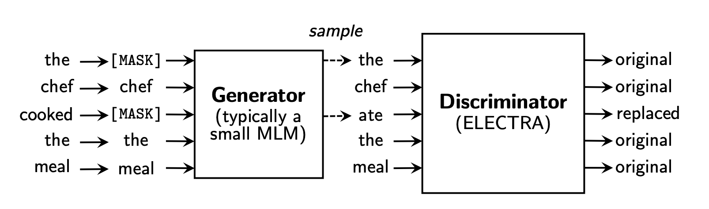
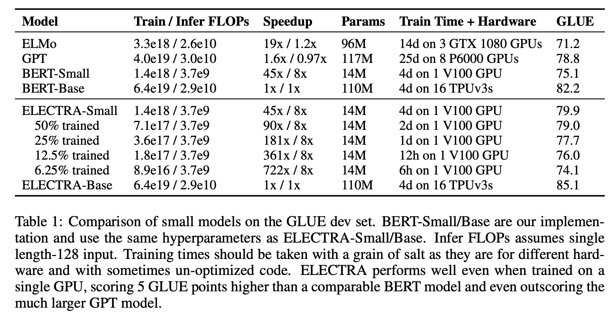

# ELECTRA: Pre-training text encoders as discriminators rather than generators

### Authors
**Kevin Clark, Minh-Thang Luong, Quoc Le and Christopher Manning**

**Google Brain/Stanford University**

### TL;DR

More efficient text encoders emerge from an attempt to do "GAN's for Text".

### A focus on efficiency

ELECTRA focuses a lot on efficiency, which is really great. This table shows the tradeoff in terms of model size, pre-train flops, performance and hardware very nicely. It's great to see realistic measurements with numbers which are actually meaningful in real life, like "1 Day on a single V100 GPU". Accessible and down to earth :thumbsup:.

Additionally, Table 5 provides great insight into where the extra performance gains are coming from with the smaller models. It demonstrates that the main benefit from the ELECTRA architecture comes from the ability to attach loss functions to all tokens in a sentence, rather than only the tokens which were masked in the input. I think a lot of new languge modeling papers over the next year will follow this theme, of finding more effective ways to include all tokens in cloze style masked language modelling.

### ELECTRA as a springboard

Overall, the ELECTRA paper has strong empirical results, great writing and nice ablations which point to exactly where the improvement is coming from. However, the thing that bumps ELECTRA up into the top tier of papers (in my opinion), is *where the next person is going to go with this*. 

This paper could easily be described as a failed attempt at an internship with the scope "Make GANs for text actually work". That sounds insulting, but actually it's a real sign of top, top research to be able to pull a paper as good as this out of the bag. Someone much smarter than me is going to pick up this paper and go "I bet I can make that backprop through the sampling work" and succeed, which is why I think that the ELECTRA paper is going to be important.

For example, an approach which occured to me when reading this paper is pretraining the generator as a masked language model, and then slowly annealing between full maximum likelihood training of the generator and using a full REINFORCE based gradient estimate using the Gumbel-Softmax Trick ([1](https://arxiv.org/abs/1611.01144), [2](https://arxiv.org/abs/1611.00712)). As with training GANs, there will be many seemingly small details which are critical to get gradient based training to work through a categorical distribution as large as the ones used in modern pretrained language models. It's great that this paper has explored and doccumented some of these ideas, e.g:

- Full weight tying isn't helpful (forces G and D to be the same size), but tying input embeddings between models is helpful.
- Initialising the Discriminator with the Generator's weights doesn't work
- Downstream performance of the Discriminator is better with a weaker Generator
- Sentence level loss functions didn't help much (additional evidence supporting the [RoBERTa paper's](https://arxiv.org/abs/1907.11692) conclusion)
- More intelligent word masking (by unigram frequency) is not important

### Intrinisc Analysis.....

The one downside to this paper is that there is no intrinisc analysis of the Discriminator network that is so effective at downstream tasks. For example, it would be interesting to know if the new discriminator loss function induces any interesting behaviour in the representations themselves - how do they differ from representations learnt by BERT, for example? 

Given that the Discriminator loss is directly trained to predict disfluency, is it well calibrated enough to use for gramatical error detection type problems? Is there any bias intrinisc in which tokens the discriminator predicts as being disfluent (e.g by POS tag)? Does an average of the discriminator score over a sentence make for a great re-ranker for speech to text applications?

### Conclusion
Overall, I thought this paper was a simple idea executed extremely well, with a very informative acompanying paper. If you're interested in representation learning for text, I'd strongly recommend reading the full paper. It has a lot of details which are all too often missing in curent NLP/ML papers, it maintains a focus on computational efficiency throught and they've released code. 

*Thanks for reading! This blog is open source, and you can suggest changes by making pull requests just by [editing the markdown files](https://github.com/DeNeutoy/blog/pulls). If you have comments, you can shout into the void on [Twitter](https://twitter.com/MarkNeumannnn).*
