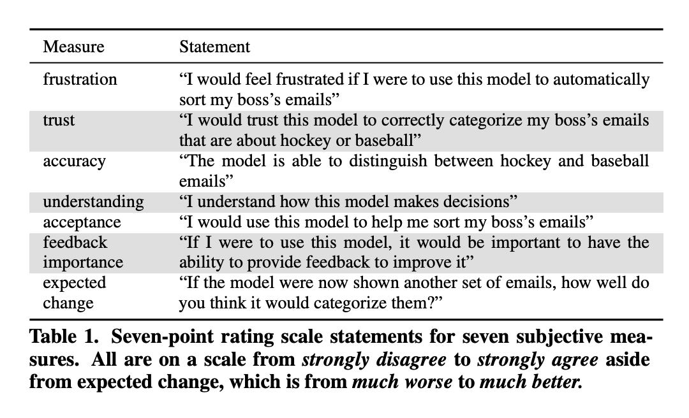
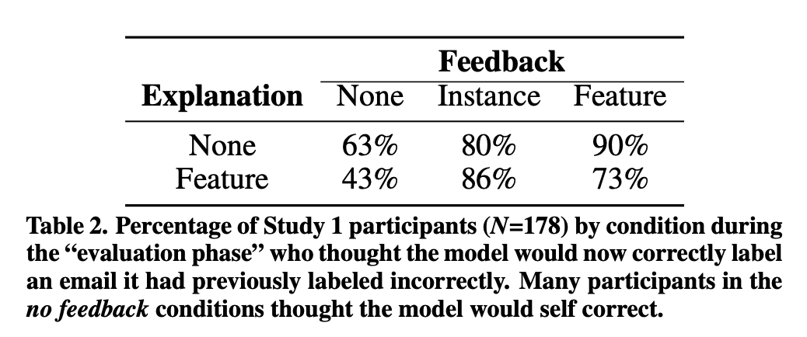

# No Explainability without Accountability: An Empirical Study of Explanations and Feedback in Interactive ML

## Authors :pencil:
**Alison Smith-Renner, Ron Fan, Melissa Birchfield, Tongshuang Wu,
Jordan Boyd-Graber, Daniel S. Weld, and Leah Findlater**

**University of Maryland/University of Washington**

## TL;DR :zzz: :book:
- **Users of machine learning models expect improvement regardless of whether or not they provide feedback**
- **Whether explanations and feedback improve a user's experience depends heavily on model quality**

## The setup

The authors perform two experiments with a multinomial naive bayes bag of words classifier, classifying emails into two categories based on topic, namely "ice hockey" and "baseball". The two experiments differ in terms of model quality; one text classifier trained to 76% accuracy and the other trained to 94.4% accuracy (by using more of the small amount of training data). Users are then shown an interface (below) where the top 3 word features from the classifier are highlighted. This methodology is nicely motivated:

- It is simple ([Too much, Too little or just right? Ways explanations impact end users' mental models](https://ieeexplore.ieee.org/document/6645235))
- It is truthful in the sense that feature importances correlate exactly with performance in the case of a Naive Bayes classifier ([How do Humans Understand Explanations from Machine Learning Systems?](http://arxiv.org/abs/1802.00682))
- 3 words (and not more) are chosen because explanations should be sufficient but not overinformative. ([Towards Maximizing the Accuracy of Human-labeled Sensor Data](https://dl.acm.org/doi/10.1145/1719970.1720006))

This was helpful for me (less familiar with HCI literature than the typical reader), as otherwise these choices seem a little arbitrary.

The users then give both *Instance* and *Feature* level feedback, correlating to whether the model correctly classified the example and whether the user felt the highlighted words were a good explanation of the model decision. Finally, users then evaluated the "updated" model based on their feedback on a new set of emails.

When reading this, I did wonder whether it's possible to collect positive examples of both of these - the model makes an incorrect prediction, but provides a faithful explanation of why it believes it correct. It would be interesting to see if such feedback can be used differently (in particular, by not treating the instance and feature level feedback as independent from one-another).

## Hypotheses

A great thing about HCI papers is how explict they are about what their experiments are testing - a far cry from some NLP/ML modelling papers. The authors explore the effect of explanations and feedback on two metrics:

#### Frustration :imp:

- Feedback (instance or feature-level) reduces frustration compared to no feedback.
- Explanations without feedback increase frustration compared to no explanation without feedback.

#### Expected Improvement :white_check_mark:

- Feedback (instance or feature-level) increases the user’s expectation that the model will improve compared to no feedback.
- Explanations increase the user’s expectation that the model will improve compared to no explanation.

Participants answered the questions shown in the interface above, in addition to answering a set of Likert scale questions about their perceptions of the model, designed to capture 7 properties.

## Experiment 1: Weak Model

**Explanations increased frustration, while user feedback reduced it.** This was mainly due to users being frustrated by model quality, which was surfaced by explanations.

Feature-level feedback increased expected improvement compared to no feedback, **but amazingly, even participants in the group which were not able to provide feedback expected the model to improve in 47% of cases.** This really demonstrates the mis-alignment between the expectations of users who interact with machine learning models and those that develop them. 

Finally, using the feature importances to update models (the authors did this by simply manually adjusting feature weights up or down by 20%) improved the model by 9.7% on average, compared to a 7.1% improvement from using instance level feedback. I thought this was a really positive finding, because it means that explanations can also double as a way to provide even more effective feedback than the supervised baseline. Yay :smile: !

## Experiment 2: Strong Model :muscle:

**Users found the explanations helpful for evaluating the stronger model's accuracy** - 80% of participants who were shown explanations thought the model was good enough compared to only 65% of those who were not. Additionally, the explanations are substantially more useful than in the first experiment, where 80% of users found the explanations to be not useful

I'm not sure this comparison is completely valid, because I think it asks slightly the wrong question - really, we should allow for explanations which demonstrate the model is _not_ working as expected (in the first experiment) as clearly users will find the explanations of a low quality model "not good enough", if they are only being asked if it is good enough, vs being able to accurately assess its performance. However, this does demonstrate that explanations improve user perceptions of models which are already strong.

**Similarly to Experiment 1, feature based feedback improved expected improvement the most** - so it seems like the ability for a user to provide feedback is helpful independently of model quality.

## Discussion :coffee: :coffee:
I thought these experiments raised quite a lot of interesting points, some of which are discussed in more depth in the paper. 

### Explicitly modelling interaction :couple:

One thing which particularly stood out to me is that the results suggest that we should think about model feedback not just in terms of labels - feedback in terms of feature importance is more effective. However, I wonder if it is possible to take this a step further, and design interactive machine learning models which explicitly model $P(y|x, I)$ where I is a set of possibly simulated interactions. It's possible that this is just a difference in terminology, but I think this paper uses a slightly narrow definition of interactive machine learning. It would be nice to see this expanded upon in later papers.

### More complex models
The authors make clear that the scope of this study is slightly restricted by using a model, task and labels which are simple and already quite interpretable. My gut feeling is that the effects reported in the paper actually become _more_ important as label classes become _less_ distinguishable. A good domain for this would be word sense disambiguation, because there are a lot of word senses which technically differ by some small nuance which a human would only differentiate through explicit explanation.

### Feature importance in more complex models
One of the real takeaways from this paper is the effectiveness of feature importance feedback for both weak and strong models. However, it's less clear how valuble this is when it's more difficult to translate the interaction that you collect into model supervision. Increasingly though, we are seeing feature attribution methods(SmoothGrad, GradCam) for black box models which are interpretable (in some sense, although probably not faithful) to humans. It's still not clear to me what the _most effective_ way of collecting supervision is for a given explanation (assuming that as a benchmark, we should be able to improve upon simply collecting the Instance label). 

### Explanation effectiveness for heavily biased models
Finally, it's a bit difficult to tell how well this paper's results generalise to models which are "good" but contain a strong bias. For example, a Named Entity Recognition model may provide faithful explanations for a given span which focus almost entirely on capitalisation. However, this explanation would not be portable to the same named entity without capitalization, which would... still be a named entity. On the flip side though, we absolutely would expect capitalisation to be an NER feature, so it seems difficult to me to examine the effectiveness of explanations for a model which we _know_ to be biased positively toward a particular feature.

### Calibration :scales:

In the final part of the author's discussion, they quite loosly use the phrase "system uncertainty" to mean model performance when discussing it's effect on faithful explanations. Ironically, it seems interesting to explore how actual model calibration effects the provision of faithful expanations - how might expanations from a highly accurate but poorly calibrated model fail? It seems likely that it will lower user trust via input manipulation, as individual features are more likely to completely flip model predictions. How this would be confounded with features being fundamentally _interpretable_ is even more interesting.

## Conclusion

Overall, I thought this paper was great, because it challenged an assumption I had that users would always benefit from model explanations and highlighted to me the gulf in expectations between users who consume machine learning models and people like me that train them. This paper has motivated me to read some more HCI papers - they seem highly relevant in practice, scientific and easy to read. 

*Thanks for reading! This blog is open source, and you can suggest changes by making pull requests just by [editing the markdown files](https://github.com/DeNeutoy/blog/pulls). If you have comments, you can shout into the void on [Twitter](https://twitter.com/MarkNeumannnn).*
