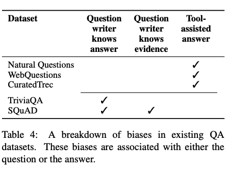
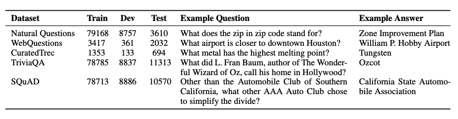
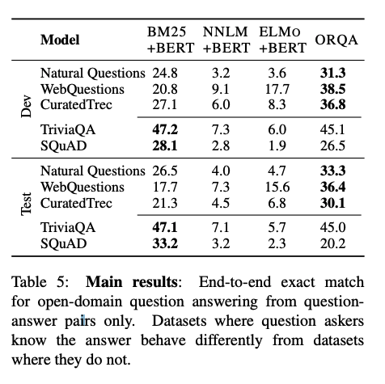
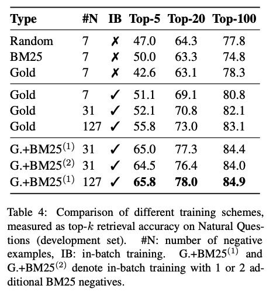

# A review of Open Domain Question Answering

Open Domain Question Answering is typically considered to be a "horizon" goal for natural language processing. Current systems, such as Siri, Amazon Alexa and Google Now add substantial value to mobile device users by providing a hands free interface. 

## Open Domain Question Answering

This review will consider 3 elements of ODQA:

- Question Understanding
- Retrieval
- Answer Processing

## Phrase-Indexed Question Answering: A New Challenge for Scalable Document Comprehension

## Real-Time Open Domain Question Answering with a Dense-Sparse Phrase Index
Code: https://github.com/uwnlp/denspi

- 6000x reduced computational cost over DRQA by pre-indexing all phrases in corpus upfront, leading to 58x faster inference

#### Method
Encode all phrases of length K in entire corpus into a combination of a dense and sparse vector. The complete vector is made up of 4 parts:

- A representation of the start word of the phrase
- A representation of the last word of the phrase
- A "coherency scalar"

Quite odd technique for forming these representations - for a given word, take it's BERT vector and split it up into 4. Then, the representation is [v1, v2, v3 . v4]. 

Sparse Index
Normalized TF-IDF embedding of each phrase, using 2-grams (~16M vocab size). This is concatenated with a paragraph level TF-IDF vector computed in the same way, designed to represent higher sensitivity to local information.

The question query representation is constructed in the same way, with the exception of pre-pending with BERT's [CLS] token, which is used as the sentence representation, rather than the beginning and end words of the question.

#### Training

Trained on Squad V1.1, given gold supporting paragraphs. Add a trainable no-answer bias to the final softmax. For each paragraph, 2 negative examples are created, 1 using a question from another article and 1 using a question from the same article but a different paragraph. Additionally, they sample these negative examples using question similarity between questions in the squad dataset. 

#### Efficiency details

Wikipedia => 3 billion tokens, => all phrases of length < 20 => 60 billion phrases. Assuming 961D vectors with float32 precision, this requires ~240 TB of storage.

Tricks to reduce memory:

- Store start and end phrase vectors independently and keep pointers to them for phrases. This reduces storage cost from N^2 to 2N, 240TB to 12TB.
- Filtering - Using a trained binary classifier on the phrase vectors, filter out unlikely answer candidates. Reduces 12TB => 5TB.
- Quantization using scalar quantization(SQ). Represent float32 values as int8s, using 1/4th of the memory. Results in final size of 1.2TB.

#### Search strategies
- Sparse First Search
- Dense First Search
- Hybrid - run both search strategies, re-rank resulting list.

**Interesting point to note** - in practice they search first on the start vector, and then on the end positions for these given start vectors. Saves memory and time, and doesn't affect accuracy much.

#### Results

Squad V1.1  EM, F1
BERT-Large 84.1 90.9
DENSPI (dense only) 73.6 81.7

DENSPI can process 28.7 million words per second, which is 6,000 times faster than DrQA and 563,000 times faster than BERT without any approximation.

IMPORTANT:
- Linear layer on top of BERT encoder massively damages performance, as does independent question/phrase encoders.

Squad Open F1, EM
DENSPI-SFS 42.5 33.3 
DENSPI-DFS 35.9 28.5
–sparse scale=0 16.3 11.2 
DENSPI-Hybrid 44.4 36.2

Takeaways - Sparse First search is very effective (authors note this might be due to high lexical overlap between Q/A pairs in squad). Completely removing any kind of sparse re-ranking results in a massive drop in performance.

## Contextualized Sparse Representations for Real-Time Open-Domain Question Answering
Code: https://github.com/jhyuklee/sparc

Problem with paper above is that the sparse part of the embedding is non-contextual - i,e the ngrams are equally scored for each word in the doc. 

#### Method

The sparse representation for a word is a weighted bag of ngrams of the sentence, weighted by the relative importance of the other words in the sentence in a similar way to the self attention layer in a transformer.

#### Training

Model is trained on SQuad, using the normal dense logits of each phrase. Then, they also factor all possible sparse phrase representations into this loss, computing them as:

logit_sparse = start_sparse * question_cls_start + end_sparse * question_cls_end

where a single dot product in the above eq is computed by:

Relu(Q*K^t/sqrt(d))_i * F for the ith word in the sentence being the start position, and F being a one hot representation of the vocab. Because this is also extra sparse for the question, it corresponds to multiplying all the non-zero attention logits of words which appear in both the query and answer. This is efficient because they are both sparse.

The final loss is the max marginal likelihood over both representations of the span, the dense and sparse representation.

#### Results
Model, C.Trec-EM, EM, F1 
DENSPI 31.6 36.2 44.4 
DENSPI + SPARC (Ours) 35.7† 40.7 49.0

Squad V1.1
DENSPI + SPARC 76.4 84.8

Notes:
- Takes 600 GPU hours to index all phrases in wikipedia. Uses uni/bigram features of BERT large vocab, corresponding to ~1B sparse vocab size.

Overall - Very clever, un-obvious idea to improve a BOW representation of words. Questions - do you even need to train this? Can you just use attention scores to weight a BOW representation for each word? It's not clear that you need to train this.

## Latent Retrieval for Weakly Supervised Open Domain Question Answering

Main interesting point: IR and QA differ because a user is attempting to retrieve _unknown_ information in the QA setting. Introduce an Inverse Cloze Task to pretrain an evidence retrieval module.

Main issue with learning the retrieval component from QA pairs is that it requires retrieval over an entire background corpus to be treated as a latent variable, which is typically impractical.

This paper makes an interesting distinction between datasets which are authored by question writers who do not already know the answer (i.e genuinely information seeking vs testing). They highlight the following biases in current widely used datasets:

### Method

Very simple model:

The retrieval score for a evidence chunk is the inner product of a projection of the BERT [CLS] token to 128 dim with a similar (but independently parameterised) projection of the question. The span scorer simply concatenates the start and end representations of a span and scores them using an MLP.

This model presents 2 massive issues:

- An enormous search space (13M blocks of evidence in wikipedia)
- Retrieval over this space is latent, and contains many spurious correlations for a given correct answer span.

To solve these issues, they invent a pretraining task which looks as similar as possible to retrieval. The Inverse Cloze Task (ICT) models this as selecting a correct evidence sentence for a given sentence, from a set of in-batch sampled negatives. 10% of the time, the query sentence is left in the evidence sentence, enouraging the model to learn both ngram overlap statistics as well as more semantic retrieval. This contrasts from IR retrieval, as in the pretraining task, there is very low natural overlap between the query sentence and it's context, unlike in a QA question/background pair.

After this pretraining step, they optimize the marginal log likelihood of all, possibly spurious correct answer spans in the top K(=5) retrieved blocks, keeping the representations of the blocks fixed. Additionally, at the start of the fine tuning on the actual QA task, they continue pretraining, computing the retrieval only loss on a larger set of retrieved examples (5000). 

Interesting point: using the pretrained ICT model, only 10% of examples are discarded due to not containing the answer span (even if it is spurious). This seems like a strong indicator for the pretraining step working very well. It would be interesting to know the stats for this for BM25, given it's a very strong retrieval method. It would also be nice to be able to quantify the bias involved in the relative datasets and compare that to performance of e.g BM25 vs ICT as the retriever.

## REALM: Retrieval-Augmented Language Model Pre-Training

Key idea = use language modelling supervision to train an intermediate latent retrieval model.

This is basically the retrieval model from above paper injected into an actual language model.

p(y|x) = SUM_z[p(y|z,x) p(z|x)]

where p(z|x) is modelled as the latent retrieval step, and p(y|z,x) is the marginal liklihood of all spans S occuring in retrieved doccuments Z which equal y.

The key issue with this model is the marginalisation over Z, all doccuments in the corpus. In practice during training, they use a top K approximation, which is reasonable in practice because most documents have a near zero probability of being retrieved for any given query.

The second issue with this model is that finding the top K doccuments requires comparing a query sentence to every doccument in the corpus. This is implemented using MIPS with an efficient pre-computed index, such as FAISS. Because the retriever is parameterised and updated during training, this has to happen asyncronously, meaning the search index built by any given retrieval model becomes stale after each gradient update. However, the authors note that it is only the index itself which becomes stale - the retrieval model recieves fresh gradients because the documents retrieved by the retrieval model are re-encoded with the up-to-date parameters. The index is periodically updated and switched in to the main trainer.

During training, they specifically mask out salient spans which require retrieval - in this case, names and dates. 

The retriever is warm started with the ICT from Kenton's previous paper, and the encoder is warm started with BERT.

## Dense Passage Retrieval for Open Domain Question Answering
Code : https://github.com/facebookresearch/DPR

Very similar to ORQA/REALM, apart from they use supervision directly to train the passage encoder.

Couple of interesting points:

- Negative sampling strategy - BM25 top passages which don't contain answer string. Uses in batch negatives + this BM25 "hard" negative.

For TREC, WebQuestions and TriviaQA, they use the highest ranked BM25 passage containing the answer string as the "gold" passage for training the retriver, as these datasets don't provide gold passages.

Nice evaluation on sample efficiency - with only 1k questions, the retriever accuracy (in terms of gold retrieved passage) is slightly higher than BM25.

Note of the efficiency of FAISS retrieval: 
"We profiled the passage retrieval speed on a server with Intel Xeon CPU E5-2698 v4 @ 2.20GHz and 512GB memory. With the help of FAISS in-memory index for real-valued vectors9 , DPR can be made incredibly efficient, processing 995.0 questions per second, returning top 100 passages per question. In contrast, BM25/Lucene (implemented in Java, using file index) processes 23.7 questions per second per CPU thread."

## Retrieval-Augmented Generation for Knowledge-Intensive NLP Tasks

Builds on Dense Passage Retrieval by replacing the QA model with a seq2seq model. Couple of interesting points:

They just keep the retrieval aspect of it fixed. This is surprising given the findings in REALM showing that this is very important. It's possible this is only important in the case that you are training the retriever end-to-end with no direct retrieval supervision and just QA pairs, rather than using supervision as they do in DPR.

## Entities as Experts: Sparse Memory Access with Entity Supervision

## Insights

 Latent Retrieval for Weakly Supervised Open Domain Question Answering andContextualized Sparse Representations for Real-Time Open-Domain Question Answering are solving inverse problems. Can they be combined in an interesting way?

## Future Directions

**Index sparsity**

Many of the above methods rely on doing ANN search over a very large corpus of embedded texts. Is there a way to make the output vectors sparse (not the model weights, but the output vectors) so that these indices are radically more efficient/compact?

**Unsupervised Encoder fine-tuning**

Currently, many methods utilising a large Nearest Neighbour index of phrase vectors rely on a large Language Model fine tuned on a Question Answering dataset such as Squad. This is problematic, because it requires in-domain supervision for a new corpus. 
TODO (poss solution: unsup QA, entity representations)

**Query Understanding**

Current methods for ODQA use a relatively naive method for encoding a question - simply using a large pretrained model to create a single dense representation, or in some cases, a mixed dense-sparse representation. Given classic information retrieval systems have seen substantial improvements from Query Expansion, Query Re-formulation, Question Type Classification and other Question Understanding techniques such as relation extraction/entity linking/coreference resolution, it remains an open question how these types of techniques can be leveraged when searching using dense representations of sentences. 

**Multi Granularity Indexing**